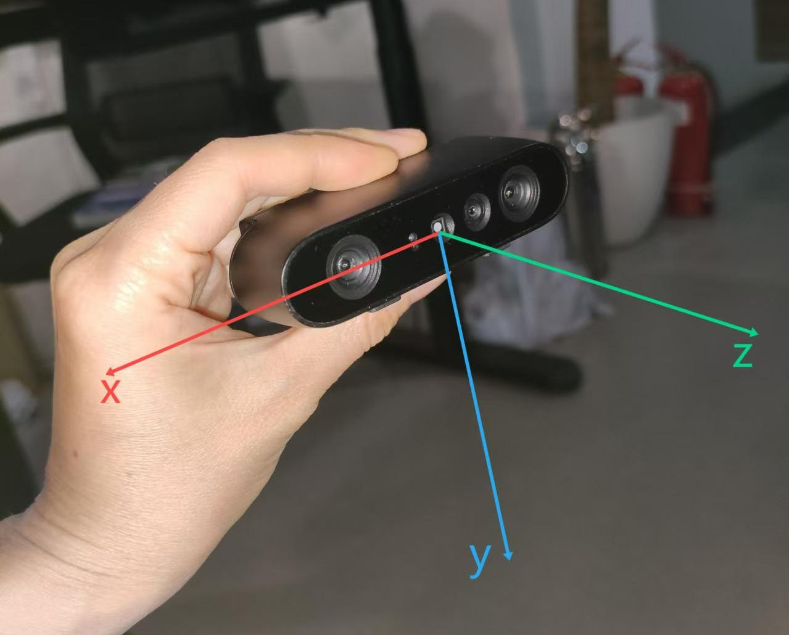

# 翻书

## 准备

(1) cd src/rgbd_pkg/scripts/data/checkpoints

(2) 查看下载链接:cat download_ckpts.txt

(3) 下载模型文件到当前路径

## 说明

### 输入：

对齐的彩色图、深度图
W: 640 pixel
H: 480 pixel

### 输出：书的上表面4个顶点在相机坐标系下的3d坐标(unit m)

顺序：0->3，形式如：[[x0,y0,z0], [x1,y1,z1], [x2,y2,z2], [x3,y3,z3]]， 对应位置如下图所示。

如果未检测到书，则输出4 x 3的全零list

目前仅支持下图中这本书，用的时候到我这里拿

		  
### 相机坐标系定义

如下图
	  

## 开始

(1) 连接奥比中光rgbd相机到nx

(2) 启动roscore

(3) 启动服务

./start_rgbd_cam_server.sh

(4) 启动节点

./start_rgbd_cam_node.sh

## 注意事项

相机的内参即采用奥比中光官方给的数据，且未去畸变，如果出现精度不够的情况可以找我标定相机
